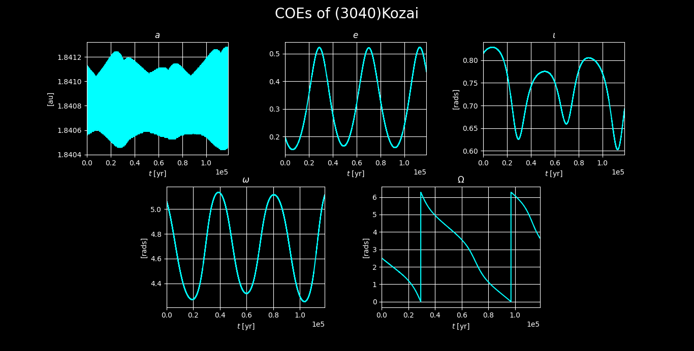

# 3BodyProblem

Authors: Narvaéz J.

 
Simulation of a system of 3 bodies interacting with each other gravitationally. It focuses on observing the time evolution in Classical Orbital Elements (COEs) in an attempt to detect the "Kozai-Lidov" effect. It takes by default the Sun and Jupiter as the 2 massive bodies, and the 3rd body is a small solar system object.

The evolution step is performed using the `PEFRL` integrator, a 4th-order symplectic algorithm [[3]](#PEFRL).

In `Makefile` one can find the parameters of the simulation. Additionally, you are free to choose other asteroids listed in "Data.asc". The data of the initial orbital elements of the asteroid shown here was taken from the JPL Horizons web-interface. Data is available at [[4]](#Data).

## References

1. R. Schwarz. (2017). M001: Keplerian Orbit Elements to Cartesian State Vectors.
2. R. Schwarz. (2017). M002: Cartesian State Vectors to Keplerian Orbit Elements.
3. 

 I.P. Omelyan, I.M. Mryglod, R. Folk (2002). Optimized Forest–Ruth- and Suzuki-like algorithms for integration of motion in many-body systems, Computer Physics Communications, Volume 146, Issue 2, pp 188-202, ISSN 0010-4655, https://doi.org/10.1016/S0010-4655(02)00451-4.
4. 

 Solar System Dynamics. (2021, September, 12). Small-Body Database Lookup. https://ssd.jpl.nasa.gov
5. Valtonen, M., & Karttunen, H. (2006). The Three-Body Problem. Cambridge: Cambridge University Press. doi:10.1017/CBO9780511616006.
